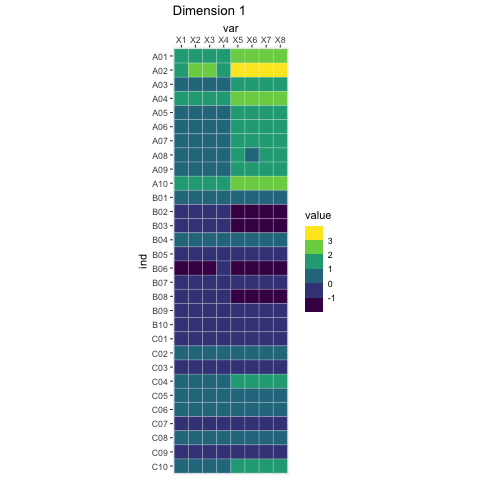

\newcommand{\X}{\mathbf{X}}
\newcommand{\u}{\mathbf{u}}
\newcommand{\w}{\mathbf{w}}


```{r setup, include=FALSE}
library(devEMF)
knitr::opts_chunk$set(echo = FALSE, dev = "emf", fig.ext = "emf")
library(dplyr)
library(FactoMineR)
library(factoextra)
library(gganimate)
library(ggplot2)
library(tidyr)

## Imports
# import::from("readxl", "read_excel")

theme_set(theme_bw())
```

# Some mental images

## Potato Chips Analysis


## Whale versus krill: this is you (credit: Allison Horst)


Artwork by `@allison_horst` https://twitter.com/allison_horst

## Whale versus krill: this is your data (credit: Allison Horst)


Artwork by `@allison_horst` https://twitter.com/allison_horst

# The tri-force of PCA

## Beautiful illustration

Screeplot, versus individual map, versus circle of correlation.
With the associated theoretical concepts: inertia (multivariate variance), distance between individuals, and angles between 

## Example data

```{r data, echo = TRUE}
xtmp <- readxl::read_excel("../data/simul.xlsx")
x <- as.matrix(xtmp[, -1])
rownames(x) <- xtmp$Ind
```

```{r pca of mini data}
res.pca.ex <- PCA(x, scale.unit = TRUE, graph = FALSE)
```

## Example screeplot

```{r scree-ex}
fviz_screeplot(res.pca.ex)
```

## Example individual map

```{r individuals-ex}
fviz_pca_ind(res.pca.ex, geom = "point", col.ind = substr(rownames(x), 1, 1), addEllipses = TRUE)
```

## Example circle of correlation

```{r variables-ex}
fviz_pca_var(res.pca.ex, repel = TRUE)
```

# Vocabulary

## French versus English

> "Aaaaah, mais acépé en fait c'est la pisci-aïe !"

*(Anonymous student, after 6 hours of teaching PCA in French)*


English | French
--------|-------
PCA = principal component analysis | ACP = analyse en composantes principales
SVD = singular value decomposition | SVD = décomposition en valeurs singulières
EVD = eigenvalue decomposition | décomposition en éléments propres
ICA = independent component analysis | ICA = analyse en composantes indépendantes
MDS = multidimensional scaling | MDS = multidimensional scaling

## R vocabulary

Base methods:

  * `eigen` for eigenvalue decomposition, `svd` for singular value decomposition,
  * `prcomp` and `princomp` for PCA,
  * `biplot`
  
Nice packages:

 * `FactoMineR`: `PCA`, `MFA`, `CA`, `MCA` and associates. In earlier versions, the graphs were "crude"...
 * `factoextra`: "helper" package to make beautiful plots, and much more!
 * `ade4`: more than "one block" type of analyses. Made by ecologists so $\Rightarrow$  PCOA, coinertia analysis, STATIS, etc.
 * `ExPosition`: made for psychometricians (they like PLS)

## And a few nice books and papers

  * MOOC multivariate data analysis by François Husson: https://husson.github.io/MOOC_AnaDo/index.html
(FR/EN)
  * PCA paper(s) by Hervé Abdi: https://personal.utdallas.edu/~herve/abdi-awPCA2010.pdf

# A little bit of Math

## Notations

(non-universal) Conventions: matrices and vectors are **bold**

  * $I$ = number of observations, $J$ = number of variables (only quantitative)
  * $i$ for an individual observation, and $j$ for a single variable
  * $\mathbf{X}$ = data matrix, with $n$ rows and $p$ columns, sometimes already centered, and scaled, to make our life easy
  * $\mathbf{X}_j$ = variable $j$, and $j$th column of $\mathbf X$
  * $\mathbf{w}$ a set of weights

## A little detour: matrix multiplication

Take a pen and paper (or R), and do this multiplication:

\[
  \left[ \begin{array}{cc} 1 & -1 \\ 0 & 1 \\ 2 & 1\end{array} \right] \times \left[ \begin{array}{ccc} 1 & 2 & 3 & 4 \\ -1 & 0 & 0 & 1\end{array} \right]
\]

[Cool video: 5 ways to see matrix multiplication](https://www.youtube.com/watch?v=Zbj-nyJyP-Q)

## PCA

 > "Find a linear combination of the columns of the data that would capture the most information."
 
 In mathematical words, find
 
\[
  \mathbf{Xw} = w_1\X_1 + \cdots + w_p\X_p
\]

that maximizes... wait a minute! What are the dimensions?

  * $\mathbf X$: $I$ rows and $J$ columns,
  * $\mathbf w$: $J$ rows and $1$ columns,
  * $\mathbf{Xw}$: $I$ rows and $1$ column.


# The mathematical translation of the intuitions behind PCA


## Most popular intuition of PCA: how does it translate?

> "PCA creates a linear combination of variables that maximizes variance."


\[
   \arg\max_{\|\w\|_2^2 = 1} \text{var}(\X\w)
\]

  * Why $\|\w\|_2 = 1$?
  * Dirty trick: $\text{var}(\X\w) = \w^\top\X^\top\X\w$


## Least "well-known" intuition of PCA: how does it translate?

> "PCA creates a linear combination of variables that maximizes correlation."

\[
   \arg\max_{\mathbf w} \sum_{j=1}^p \text{cor}(\mathbf{Xw}, \mathbf{X}_j)^2
\]

## Second least "well-known" intuition of PCA: how does it translate?

> "PCA creates the best lower rank approximation of the covariance matrix."

\[
   \arg\min_{\|w\|_2^2 = 1} \left\| \frac{1}{n}\X^\top\X - \lambda\w\w^\top \right\|_F^2
\]


  * $\frac{1}{n}\X^\top\X$
  * $\lambda$: the [blank] of the covariance matrix
  * $\w$: the [blank] of the covariance matrix

## A little image

```{r rank1-covariance-ex}
a <- sprintf("X%i", 1:7)
cov.ex <- cov(x)
res.eig.ex <- eigen(cov.ex)
lambda1 <- res.eig.ex$values[1]
w1 <- res.eig.ex$vectors[,1]
rank1 <- lambda1 * w1 %*% t(w1)
dimnames(rank1) <- dimnames(cov.ex)

before <- as_tibble(cov.ex, rownames = "row") %>%
  pivot_longer(-1, names_to = "col") %>%
  mutate(row = factor(row, levels = rev(a))) %>%
  ggplot(aes(col, row, fill = value)) +
  geom_tile(color = "white") + 
  scale_fill_viridis_b() + 
  scale_x_discrete(position = "top") +
  coord_equal() + 
  labs(title = "Covariance matrix")

after <- as_tibble(rank1, rownames = "row") %>%
  pivot_longer(-1, names_to = "col") %>%
  mutate(row = factor(row, levels = rev(a))) %>%
  ggplot(aes(col, row, fill = value)) +
  geom_tile(color = "white") + 
  scale_fill_viridis_b() + 
  scale_x_discrete(position = "top") +
  coord_equal()+ 
  labs(title = "Rank 1 approximation")

ggpubr::ggarrange(before, after, ncol = 2, legend = "none")
```

## Rank-1 approximations


## Increasing rank approximations


## We can do the same kind of magic with the data itself

> Singular value decomposition can be used to approximate a rectangular matrix with a lower ranked matrix of the same dimension.

\[
  \arg\min_{\|\u\|_2^2=\|\w\|_2^2=1} \left\| \X - \delta\u\w^\top \right\|_F^2
\]

  * $\delta$: singular value
  * $\u$: left singular vector
  * $\w$: right singular vector


## Rank 1 approximation

```{r svd rank 1}
res.svd.ex <- svd(x)
b <- rownames(x)
rank1svd <- function(k) {
  deltak <- res.svd.ex$d[k]
  uk <- res.svd.ex$u[,k]
  wk <- res.svd.ex$v[,k]
  rankk <- deltak * uk %*% t(wk)
  dimnames(rankk) <- dimnames(x)
  rankk_melted <- as_tibble(rankk, rownames = "ind") %>%
    pivot_longer(-1, names_to = "var") %>%
    mutate(
      ind = factor(ind, levels = b),
      k = k)
  return(rankk_melted)
}


gdat <- as_tibble(x, rownames = "ind") %>%
    pivot_longer(-1, names_to = "var") %>%
    mutate(
      ind = factor(ind, levels = b)) %>%
  ggplot(aes(var, ind, fill = value)) +
  geom_tile(color = "white") + 
  scale_fill_viridis_b() + 
  scale_x_discrete(position = "top") +
  coord_equal()


gr1approx <- rank1svd(1) %>%
  ggplot(aes(var, ind, fill = value)) +
  geom_tile(color = "white") + 
  scale_fill_viridis_b() + 
  scale_x_discrete(position = "top") +
  coord_equal()


ggpubr::ggarrange(gdat, gr1approx, ncol = 2, legend = "none")

```

## Rank-1 approximations



## Increasing rank approximations


# Constraining the SVD

## LASSO

LASSO is a (relatively) recent technique originally intended for regression problems:

$$
  \arg\min_{\boldsymbol{\beta}} \left\| \mathbf{y} - \mathbf{X}\boldsymbol{\beta} \right\|_2^2 \text{ such that } \|\boldsymbol{\beta}\|_1 \leq r 
$$
or the dual form
$$
  \arg\min_{\boldsymbol{\beta}} \left\| \mathbf{y} - \mathbf{X}\boldsymbol{\beta} \right\|_2^2 + \lambda \|\boldsymbol{\beta}\|_1 
$$


  * the obtained weights are sparse (with zeros)
  * the non-zeros coefficients correspond to important variables
  * the result is biased
  * selecting $\lambda$ is done through cross-validation


## Optimization problem


$$
\begin{aligned}
  (\delta_\ell, \mathbf{p}_\ell, \mathbf{q}_\ell) = \arg\min_{\boldsymbol{\beta}} \left\| \mathbf{X} - \delta\mathbf{p}^\top\mathbf{q} \right\|_2^2 \\
  \text{ such that } 
    \begin{cases} 
      \mathbf{p}^\top\mathbf{M}\mathbf{p} = \mathbf{q}^\top\mathbf{W}\mathbf{q} = 1 \\ 
      \mathbf{p}^\top\mathbf{M}\mathbf{p_{\ell^\prime}} = \mathbf{q}^\top\mathbf{W}\mathbf{q_{\ell^\prime}} = 0, \forall \ell^\prime < \ell \\ 
      \|\mathbf{p}\|_1 \leq s_{\mathbf{p},\ell} \text{ and } \|\mathbf{q}\|_1 \leq s_{\mathbf{q},\ell}
    \end{cases}
\end{aligned}
$$

## What are the parameters?


  * $\mathbf M$ and $\mathbf W$ = masses, weights... so metrics
  * $s_{\mathbf{p},\ell}$ and $s_{\mathbf{q},\ell}$ = sparsity parameters, between 1 (strong sparsity), and $\sqrt{\text{dimension}}$ (no sparsity)


## A few fun papers

We belong to the fan club of: [@Witten2009; @Trendafilov2014, Journee2010].

Our work on:

  * Constrained Singular Value Decomposition [@Guillemot2019]
  * Sparse Correspondence Analysis [@Abdi2024]
  * Sparse Multiple Correspondence Analysis [@Guillemot2020; @Yu2024]
  
## References